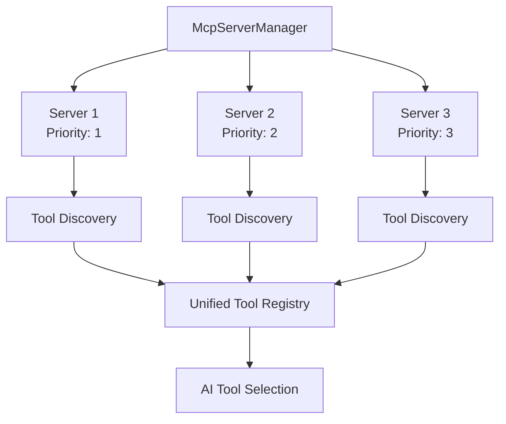
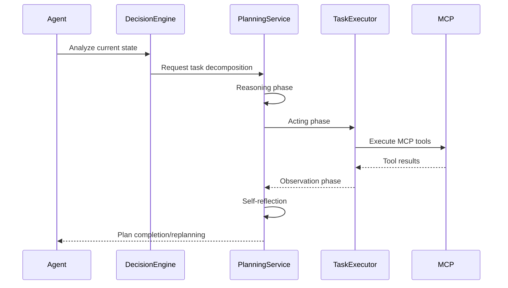

# Misoto CLI Codebase Documentation

## Table of Contents
- [Project Overview](#project-overview)
- [Core Technologies](#core-technologies)
- [Architecture Overview](#architecture-overview)
- [Main Components](#main-components)
  - [Application Entry Points](#1-application-entry-points)
  - [Agent System](#2-agent-system-core-feature)
  - [AI Integration](#3-ai-integration)
  - [MCP System](#4-mcp-model-context-protocol-system)
  - [Command System](#5-command-system)
- [Key Workflows](#key-workflows)
- [Configuration](#configuration)
- [Advanced Features](#advanced-features)
- [Testing & Development](#testing--development)

## Project Overview

**Misoto** is a Java-based CLI application that ports TypeScript Claude Code functionality to Java using Spring Boot. It's a sophisticated autonomous agent system with AI integration and Model Context Protocol (MCP) support.

### Core Technologies

- **Java 17** with Spring Boot 3.5
- **Spring AI** for Anthropic Claude integration  
- **Multi-provider AI system** (Anthropic + Ollama)
- **MCP (Model Context Protocol)** for external tool integration
- **WebSocket/HTTP/SSE** communication protocols

## Architecture Overview

```
┌─────────────────────────────────────────────────────────────┐
│                    MisotoApplication                        │
│                  (Spring Boot Entry)                       │
└─────────────────────┬───────────────────────────────────────┘
                      │
┌─────────────────────▼───────────────────────────────────────┐
│                   ClaudeCli                                 │
│              (CommandLineRunner)                            │
└─────────────────────┬───────────────────────────────────────┘
                      │
    ┌─────────────────┼─────────────────┐
    │                 │                 │
    ▼                 ▼                 ▼
┌─────────┐    ┌─────────────┐    ┌─────────────┐
│Command  │    │Agent System │    │AI + MCP     │
│Registry │    │            │    │Integration  │
└─────────┘    └─────────────┘    └─────────────┘
```

## Main Components

### 1. Application Entry Points

#### `MisotoApplication.java`
- **Role**: Main Spring Boot entry point with MCP CLI preprocessing
- **Key Functions**:
  - Environment initialization via `DotenvLoader`
  - MCP CLI options preprocessing
  - Configuration file management
  - Application mode detection (CLI vs Web)

```java
// Environment check example
log.info("Environment check - ANTHROPIC_MODEL: {}", 
    DotenvLoader.hasEnv("ANTHROPIC_MODEL") ? 
    DotenvLoader.getEnv("ANTHROPIC_MODEL") : "Not found");
```

#### `ClaudeCli.java`
- **Role**: CommandLineRunner handling argument parsing and command execution
- **Key Functions**:
  - Command-line argument parsing
  - Command dispatching via `CommandRegistry`
  - Error handling and telemetry
  - Agent shutdown progress display

### 2. Agent System (Core Feature)

The agent system is the centerpiece - an autonomous task execution framework implementing ReAct (Reasoning + Acting) methodology.

#### Core Components

| Component | Role | Key Features |
|-----------|------|--------------|
| **`AgentService`** | Main orchestrator | Lifecycle management, execution loop, error recovery |
| **`TaskExecutorService`** | Task execution engine | 12+ task types, intelligent error handling |
| **`TaskQueueService`** | Task management | Priority queuing, dependency resolution, retry logic |
| **`DecisionEngine`** | AI decision making | Strategy planning, risk assessment, confidence scoring |
| **`PlanningService`** | ReAct planning | Task decomposition, tool selection, self-reflection |
| **`MonitoringService`** | Continuous monitoring | File system watching, scheduled triggers |

#### Task Types Supported

```java
// File Operations
TASK_TYPE_FILE_READ, TASK_TYPE_FILE_WRITE, TASK_TYPE_FILE_COPY, 
TASK_TYPE_FILE_DELETE, TASK_TYPE_DIRECTORY_SCAN

// Command Execution  
TASK_TYPE_SHELL_COMMAND, TASK_TYPE_SCRIPT_EXECUTION, TASK_TYPE_BACKGROUND_PROCESS

// AI Operations
TASK_TYPE_AI_ANALYSIS, TASK_TYPE_CODE_GENERATION, TASK_TYPE_DECISION_MAKING

// MCP Operations
TASK_TYPE_MCP_TOOL_CALL, TASK_TYPE_MCP_RESOURCE_ACCESS

// System Operations
TASK_TYPE_SYSTEM_MONITORING, TASK_TYPE_HEALTH_CHECK, TASK_TYPE_COMPOSITE_TASK
```

#### Agent Modes

| Mode | Description | Use Case |
|------|-------------|----------|
| **INTERACTIVE** | Responds to user inputs, asks confirmation | Development, debugging |
| **AUTONOMOUS** | Operates independently | Production automation |
| **SUPERVISED** | Autonomous with decision reporting | Monitored automation |
| **MANUAL** | Only acts when explicitly commanded | Controlled execution |

### 3. AI Integration

#### Multi-Provider Architecture

```java
// Provider Selection Logic
┌─────────────────┐    ┌──────────────────┐    ┌─────────────────┐
│ AiProviderManager│───▶│ AnthropicProvider│───▶│ Spring AI Client│
│                 │    │                  │    │                 │
│                 │    └──────────────────┘    └─────────────────┘
│                 │    ┌──────────────────┐    ┌─────────────────┐
│                 │───▶│  OllamaProvider  │───▶│ HTTP Client     │
└─────────────────┘    └──────────────────┘    └─────────────────┘
```

#### Key Features
- **Automatic Provider Switching**: Falls back to available providers
- **Model Management**: Dynamic model switching within providers  
- **Usage Tracking**: Token counting, cost calculation, performance metrics
- **Configuration Schema**: Validation and dynamic configuration

#### Provider Configuration

```java
// AnthropicProvider - Spring AI Integration
@Value("${spring.ai.anthropic.chat.model:claude-sonnet-4-20250514}")
private String currentModel;

// OllamaProvider - Direct HTTP
private final String baseUrl = "${MISOTO_AI_OLLAMA_URL:http://localhost:11434}";
```

### 4. MCP (Model Context Protocol) System

#### Multi-Server Architecture



#### Key Components

| Component | Responsibility |
|-----------|----------------|
| **`McpServerManager`** | Multi-server connection management |
| **`McpClient`** | JSON-RPC communication (HTTP/WebSocket/SSE) |
| **`McpConfigurationService`** | Runtime configuration management |
| **Tool Registry** | Dynamic tool discovery and schema validation |

#### Configuration Example

```json
{
  "client": {
    "name": "misoto-cli",
    "version": "1.0.0",
    "connectionTimeout": 30000,
    "readTimeout": 60000
  },
  "servers": {
    "default": {
      "url": "http://localhost:8080",
      "name": "Local MCP Server",
      "enabled": true,
      "priority": 1,
      "headers": {}
    },
    "tools": {
      "url": "http://localhost:8082", 
      "name": "Tools MCP Server",
      "enabled": false,
      "priority": 3
    }
  }
}
```

### 5. Command System

#### Command Categories

| Category | Commands | Description |
|----------|----------|-------------|
| **AI Assistance** | `ask`, `chat`, `explain`, `analyze` | Core AI interactions |
| **Configuration** | `mcp`, `provider`, `status` | System configuration |
| **Authentication** | `login`, `logout` | API authentication |
| **Development** | `info` | System information |

#### Command Implementation Pattern

```java
@Component
public class AskCommand implements Command {
    @Override
    public String getName() { return "ask"; }
    
    @Override
    public String getDescription() { return "Ask Claude a question"; }
    
    @Override
    public boolean requiresAuth() { return true; }
    
    @Override
    public void execute(List<String> args) throws Exception {
        // Command implementation
    }
}
```

## Key Workflows

### 1. Agent Operation (ReAct Methodology)



### 2. Task Execution Flow

```
Task Submission
       ↓
Priority Assessment
       ↓
Dependency Check
       ↓
Queue Assignment
       ↓
Concurrent Execution (max 3)
       ↓
AI-Powered Error Handling
       ↓
Result Processing
       ↓
State Persistence
       ↓
Cleanup
```

### 3. AI-MCP Integration Pattern

```java
// AI determines which MCP tools to call
private AgentTask.TaskResult executeMcpToolCall(AgentTask task) throws Exception {
    String toolName = (String) task.getParameters().get("tool_name");
    Map<String, Object> arguments = (Map<String, Object>) task.getParameters().get("arguments");
    
    // Dynamic tool discovery
    List<McpTool> availableTools = mcpServerManager.getAvailableTools();
    
    // AI-guided tool selection
    McpTool selectedTool = aiClient.selectBestTool(toolName, availableTools);
    
    // Execute tool with AI-generated arguments
    McpToolResult result = mcpServerManager.callTool(selectedTool, arguments);
    
    // Process result and return to AI for further reasoning
    return processToolResult(result);
}
```

## Configuration

### Environment Variables

```bash
# AI Provider Configuration
ANTHROPIC_API_KEY=sk-ant-api03-...              # Claude AI API key
ANTHROPIC_MODEL=claude-sonnet-4-20250514        # Specific model override
MISOTO_AI_DEFAULT_PROVIDER=anthropic            # Default provider

# Ollama Configuration
OLLAMA_HOST=http://localhost:11434              # Ollama server URL
MISOTO_AI_OLLAMA_MODEL=qwen2.5:0.5b             # Default Ollama model

# Agent Configuration
MISOTO_AGENT_MODE=true                          # Enable agent mode
MISOTO_AGENT_MAX_TASKS=3                        # Max concurrent tasks
MISOTO_AGENT_INTERVAL=5000                      # Execution interval (ms)

# Optional
MISOTO_CONFIG_DIR=~/.misoto                     # Config directory
```

### Configuration Files

| File | Purpose | Format |
|------|---------|--------|
| `application.properties` | Spring Boot configuration | Properties |
| `mcp.json` | MCP server configurations | JSON |
| `.env` | Environment variables | Key=Value |
| `agent-state.json` | Persistent agent state | JSON |

### Spring Boot Configuration Example

```properties
# Anthropic Claude AI Configuration
spring.ai.anthropic.api-key=${ANTHROPIC_API_KEY:api_key}
spring.ai.anthropic.chat.model=${ANTHROPIC_MODEL:claude-sonnet-4-20250514}
spring.ai.anthropic.chat.temperature=${ANTHROPIC_TEMPERATURE:0.7}
spring.ai.anthropic.chat.max-tokens=${ANTHROPIC_MAX_TOKENS:8000}

# Agent Mode Configuration
misoto.agent.mode.enabled=${MISOTO_AGENT_MODE:true}
misoto.agent.max-concurrent-tasks=${MISOTO_AGENT_MAX_TASKS:3}
misoto.agent.execution-interval-ms=${MISOTO_AGENT_INTERVAL:5000}

# AI Provider Configuration
misoto.ai.default-provider=${MISOTO_AI_DEFAULT_PROVIDER:anthropic}
misoto.ai.ollama.base-url=${MISOTO_AI_OLLAMA_URL:${OLLAMA_HOST:http://localhost:11434}}
```

## Advanced Features

### 1. Intelligent Code Generation

```java
// Multi-language support with automatic execution
public class CodeGenerationTask {
    private final List<String> supportedLanguages = List.of(
        "python", "java", "javascript", "typescript", "bash", "sql"
    );
    
    // AI-powered error detection and fixing (up to 3 retries)
    private void executeWithRetry(String code, String language) {
        int maxRetries = 3;
        for (int i = 0; i < maxRetries; i++) {
            try {
                executeCode(code, language);
                break;
            } catch (Exception e) {
                code = aiClient.fixCode(code, e.getMessage());
            }
        }
    }
}
```

### 2. Context-Aware File Operations

```java
// Automatic backup creation and intelligent content merging
public class FileContextService {
    public void performFileOperation(String path, String content, OperationMode mode) {
        // Create backup before modification
        createBackup(path);
        
        // Detect operation mode based on AI analysis
        OperationMode detectedMode = detectOperationMode(content, path);
        
        // Language-specific merging
        if (isCodeFile(path)) {
            content = performIntelligentCodeMerge(path, content);
        }
        
        // Execute operation with context preservation
        executeOperation(path, content, detectedMode);
    }
}
```

### 3. Autonomous Task Management

#### Priority System

| Priority | Level | Description | Use Case |
|----------|-------|-------------|----------|
| **CRITICAL** | 1 | Immediate execution | System failures, security issues |
| **HIGH** | 2 | High priority tasks | User requests, important fixes |
| **MEDIUM** | 3 | Standard priority | Regular operations |
| **LOW** | 4 | Lower priority | Optimization, cleanup |
| **BACKGROUND** | 5 | Background maintenance | Monitoring, logging |

#### Task Dependencies

```java
// Automatic dependency resolution
public class TaskDependencyManager {
    public void addTask(AgentTask task) {
        // Check for dependencies
        List<AgentTask> dependencies = resolveDependencies(task);
        
        // Schedule dependent tasks first
        dependencies.forEach(this::scheduleTask);
        
        // Schedule main task
        scheduleTask(task);
    }
}
```

### 4. Multi-Modal Operations

#### File System Operations
- **Intelligent Content Merging**: Language-aware code merging
- **Backup Creation**: Automatic versioning before modifications
- **Operation Mode Detection**: CREATE, REPLACE, MODIFY, APPEND, AUTO

#### Shell Command Execution
- **Error Recovery**: AI-powered command fixing
- **Background Processes**: Async execution with monitoring
- **Security**: Path sanitization and command validation

#### MCP Tool Integration
- **Dynamic Discovery**: Runtime tool discovery across servers
- **Load Balancing**: Priority-based server selection
- **Schema Validation**: Automatic parameter validation

#### System Monitoring
- **File System Watching**: Real-time change detection
- **Health Checks**: Continuous service monitoring
- **Resource Monitoring**: Memory, CPU, disk usage tracking

## Testing & Development

### Build Commands

```bash
# Quick build (skip tests)
cd misoto && ./mvnw clean package -DskipTests

# Build with tests
cd misoto && ./mvnw clean package

# Run tests only
cd misoto && ./mvnw test

# Run specific test class
cd misoto && ./mvnw test -Dtest=AgentSystemIntegrationTest

# Development mode (auto-restart)
cd misoto && ./mvnw spring-boot:run
```

### Execution Modes

#### CLI Mode
```bash
# Direct JAR execution
cd misoto && java -jar target/misoto-0.0.1-SNAPSHOT.jar <command>

# PowerShell wrapper (auto-builds)
cd misoto && ./claude-code.ps1 <command>
```

#### Agent Chat Mode
```bash
# Interactive agent mode
cd misoto && ./scripts/start-agent-chat.ps1

# Agent mode testing
cd misoto && ./scripts/test-agent-mode.ps1
```

#### MCP Testing
```bash
# MCP integration tests
cd misoto && ./scripts/test-mcp-integration.ps1

# Multi-server MCP testing
cd misoto && ./scripts/test-mcp-multi-server.ps1
```

### Test Structure

| Test Type | Location | Purpose |
|-----------|----------|---------|
| **Unit Tests** | `src/test/java/` | Component testing |
| **Integration Tests** | `src/test/java/*/agent/` | Agent system testing |
| **MCP Tests** | `scripts/test-mcp-*.ps1` | MCP protocol testing |
| **Agent Tests** | `scripts/test-agent-*.ps1` | Agent behavior testing |

### Development Workflow

1. **Environment Setup**
   ```bash
   export ANTHROPIC_API_KEY=sk-ant-api03-...
   export MISOTO_AI_DEFAULT_PROVIDER=anthropic
   ```

2. **Quick Development Cycle**
   ```bash
   # Build and test
   ./mvnw clean package -DskipTests
   
   # Run with development profile
   ./claude-code.ps1 <command>
   ```

3. **Agent Development**
   ```bash
   # Start agent in interactive mode
   ./scripts/start-agent-chat.ps1
   
   # Test specific agent functionality
   ./scripts/test-agent-mode.ps1
   ```

4. **MCP Development**
   ```bash
   # Start MCP server
   cd mcp-server && ./gradlew bootRun
   
   # Test MCP integration
   ./scripts/test-mcp-integration.ps1
   ```

---

## Summary

This codebase represents a sophisticated fusion of:
- **AI-driven decision making** with multi-provider support
- **Autonomous task execution** using ReAct methodology  
- **External tool integration** via MCP protocol
- **Intelligent file operations** with context preservation
- **Multi-modal system interactions** (files, shell, AI, MCP)

The result is a powerful CLI assistant that can operate independently while maintaining human oversight capabilities, making it suitable for both interactive development and autonomous system administration tasks.