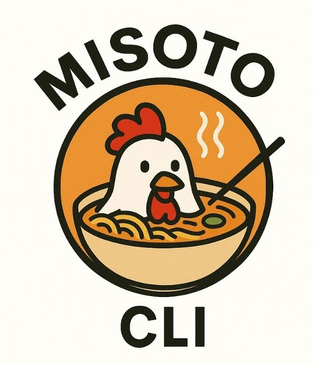

# Claude Code CLI - Java Version (Misoto)
<div align="center">
  
  <h3>AI-Powered Infrastructure Agent System</h3>
  <p><em>A sophisticated command-line interface for autonomous infrastructure management</em></p>
</div>

This project contains a Java conversion of the TypeScript Claude Code CLI, integrated into a Spring Boot application with advanced agent capabilities, MCP integration, and autonomous task execution.

## Overview

The CLI provides comprehensive functionality:
- **Authentication**: Login/logout with Claude AI API
- **AI Assistance**: Ask questions to Claude AI with multi-provider support
- **Code Analysis**: Explain code files using Claude AI
- **Agent System**: Autonomous task execution with different operational modes
- **MCP Integration**: Model Context Protocol support with multi-server capabilities
- **Planning System**: ReAct-based planning for complex task decomposition
- **Help System**: Built-in help and command documentation

## Documentation

### Core Documentation

| Document | Purpose | Key Features |
|----------|---------|--------------|
| [README.md](README.md) | Main project documentation | Installation, usage, architecture overview |
| [CLAUDE.md](CLAUDE.md) | Development guidance for Claude Code | Build commands, architecture, configuration |
| [CLI-README.md](CLI-README.md) | Basic CLI documentation | Command usage, authentication, examples |

### Feature Documentation

| Document | Feature Area | Description |
|----------|--------------|-------------|
| [AGENT_MODE_README.md](AGENT_MODE_README.md) | Agent System | Autonomous operation, task types, architecture |
| [PLANNING_SYSTEM_README.md](PLANNING_SYSTEM_README.md) | Planning & ReAct | Task decomposition, ReAct cycles, memory management |

### Implementation Status

| Document | Status | Description |
|----------|---------|-------------|
| [PORTING_DOCUMENTATION.md](PORTING_DOCUMENTATION.md) | ✅ Complete | TypeScript to Java migration documentation |
| [AGENT_IMPLEMENTATION_COMPLETE.md](AGENT_IMPLEMENTATION_COMPLETE.md) | ✅ Complete | Agent system implementation completion |
| [MCP_CONFIG_MIGRATION_COMPLETED.md](MCP_CONFIG_MIGRATION_COMPLETED.md) | ✅ Complete | MCP configuration migration |
| [MCP_MULTI_SERVER_COMPLETION.md](MCP_MULTI_SERVER_COMPLETION.md) | ✅ Complete | Multi-server MCP support |
| [PARAMETER_VALIDATION_ENHANCEMENT_COMPLETE.md](PARAMETER_VALIDATION_ENHANCEMENT_COMPLETE.md) | ✅ Complete | Parameter validation enhancements |
| [PROJECT_STRUCTURE_UPDATED.md](PROJECT_STRUCTURE_UPDATED.md) | ✅ Complete | Project structure updates |

### Project Management

| Document | Type | Purpose |
|----------|------|---------|
| [MARKDOWN_FILES_INVENTORY.md](MARKDOWN_FILES_INVENTORY.md) | Inventory | Complete listing of all markdown files |
| [package.md](package.md) | Configuration | Package configuration details |
| [package-lock.md](package-lock.md) | Dependencies | Dependency lock information |


## Key Features Converted from TypeScript

1. **Command Line Parsing**: Converts TypeScript argument parsing to Java
2. **Command Registry**: Maintains a registry of available commands with categories
3. **Help System**: Generates formatted help output for commands
4. **Error Handling**: User-friendly error messages and proper exit codes
5. **Authentication**: Token-based authentication with local storage
6. **AI Integration**: Uses Spring AI Anthropic integration for Claude API calls

## Installation and Setup

### Prerequisites
- Java 17 or higher
- Maven 3.6 or higher
- Claude API key from Anthropic

### Building the Project

```powershell
# Build the project
.\mvnw.cmd clean package -DskipTests

# Or use the provided script
.\claude-code.ps1 --version
```

### Configuration

Set your Claude API key either:

1. **Environment Variable** (Recommended):
   ```powershell
   $env:ANTHROPIC_API_KEY = "sk-ant-api03-..."
   ```

2. **CLI Login** (Alternative):
   ```powershell
   java -jar target\misoto-0.0.1-SNAPSHOT.jar login
   ```

## Usage

### Running the CLI

```powershell
# Using Java directly
java -jar target\misoto-0.0.1-SNAPSHOT.jar <command> [arguments]

# Using PowerShell script (auto-builds if needed)
.\claude-code.ps1 <command> [arguments]

# Using Batch script 
.\claude-code.bat <command> [arguments]
```

### Available Commands

#### Authentication
```powershell
# Login with API token
java -jar target\misoto-0.0.1-SNAPSHOT.jar login --token sk-ant-api03-...

# Login interactively
java -jar target\misoto-0.0.1-SNAPSHOT.jar login

# Logout
java -jar target\misoto-0.0.1-SNAPSHOT.jar logout
```

#### AI Assistance
```powershell
# Ask a question
java -jar target\misoto-0.0.1-SNAPSHOT.jar ask "How do I implement a binary search tree in Java?"

# Explain a code file
java -jar target\misoto-0.0.1-SNAPSHOT.jar explain src\main\java\MyClass.java

# Explain with focus
java -jar target\misoto-0.0.1-SNAPSHOT.jar explain MyClass.java --focus=algorithm
```

#### Help and Information
```powershell
# Show all commands
java -jar target\misoto-0.0.1-SNAPSHOT.jar help

# Show help for specific command
java -jar target\misoto-0.0.1-SNAPSHOT.jar help ask

# Show version
java -jar target\misoto-0.0.1-SNAPSHOT.jar version
```

## Key Differences from TypeScript Version

1. **Spring Boot Integration**: Uses Spring Boot's dependency injection and configuration
2. **Spring AI**: Leverages Spring AI for Anthropic Claude integration
3. **Java Type System**: Strongly typed interfaces and classes instead of TypeScript types
4. **Maven Dependencies**: Uses Maven for dependency management instead of npm
5. **JAR Packaging**: Distributed as a self-contained JAR instead of npm package

## Development

### Adding New Commands

1. Create a new command class implementing the `Command` interface:
   ```java
   @Component
   public class MyCommand implements Command {
       // Implement required methods
   }
   ```

2. Register the command in `CommandRegistrationService`:
   ```java
   @Autowired
   private MyCommand myCommand;
   
   // Add to registerAllCommands() method
   commands.add(myCommand);
   ```

### Configuration Options

Configure the application through `application.properties`:

```properties
# Claude AI Configuration
spring.ai.anthropic.api-key=${ANTHROPIC_API_KEY}
spring.ai.anthropic.chat.model=claude-3-sonnet-20240229
spring.ai.anthropic.chat.temperature=0.7
spring.ai.anthropic.chat.max-tokens=4000

# Logging
logging.level.sg.edu.nus.iss.misoto.cli=INFO
```

## Troubleshooting

### Common Issues

1. **No API Key**: Set the `ANTHROPIC_API_KEY` environment variable or use the login command
2. **Java Version**: Ensure you're using Java 17 or higher
3. **Build Issues**: Run `.\mvnw.cmd clean compile` to rebuild

### Authentication

The CLI stores authentication tokens in `~/.claude-code/auth.token` on your system. Use the `logout` command to clear stored credentials.

## License

This project maintains the same license as the original TypeScript implementation.
